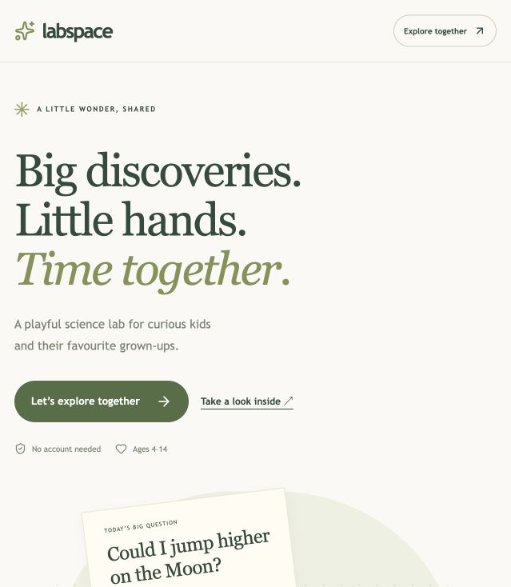
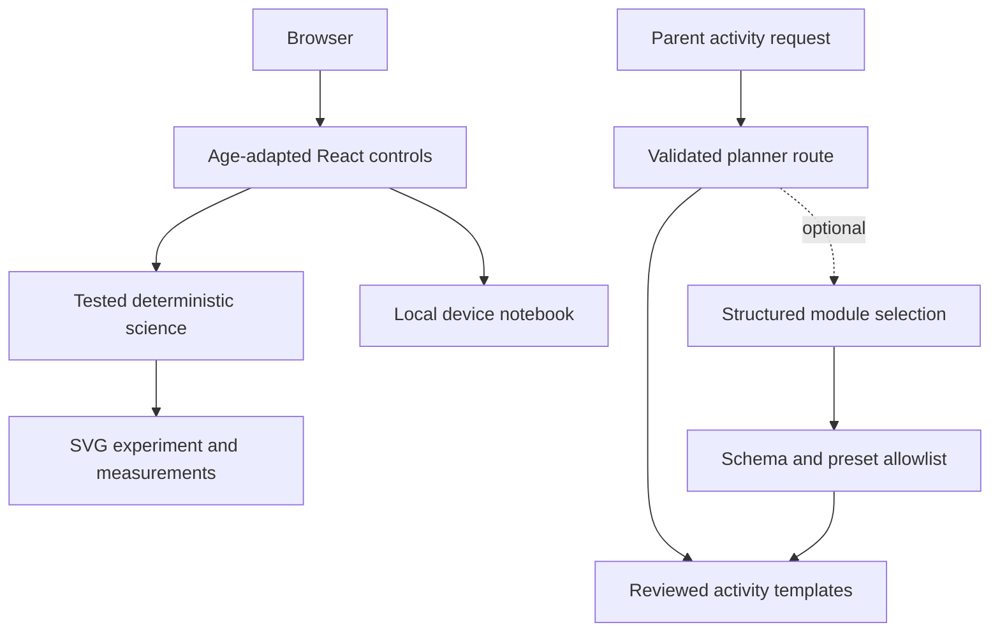

# LABSPACE

**Little questions. Big discoveries. Together.**

  



## Overview

A virtual science lab for children and families. Predict, manipulate, compare, explain and keep a discovery. The 4–6, 7–10 and 10–14 experiences use different controls and levels of explanation.

## Try it

[Open the live LABSPACE demo](https://lior-labspace.vercel.app). Deployed on Vercel Hobby and checked on 2026-10-01. Local startup is documented below. The in-app **How it works** page explains the implementation and its limits.

**Two-minute walkthrough:** Open /explore/motion → choose an age → predict → run or see the result → change one parameter → write an observation → keep the discovery → reopen its settings from the notebook.

## Features

- Motion, pendulum and additive-light experiments driven by tested deterministic functions.
- Large preset buttons for younger children, sliders and measurements for older learners, and optional local English speech.
- A parent-child path that celebrates observations without scoring guesses or rewarding daily attendance.
- A local notebook with predictions, observations, settings, a reproducible diagram and JSON export. No account is required.
- A parent-only activity planner with prewritten activities by default. The optional AI selects an allowed module and preset; reviewed templates supply instructions and the engine calculates results.

## Architecture



See [Architecture](docs/ARCHITECTURE.md), [Deployment](docs/DEPLOYMENT.md) and [Verification](docs/VERIFICATION.md).

## Stack

Next.js App Router, React, strict TypeScript, Zod, Lucide, hand-written responsive CSS, Vitest and Playwright. Public pages use Server Components; interactive controls stay in small client components. GitHub Actions checks source quality, tests and builds.

No server database is needed for this release. Avoiding accounts and remote persistence reduces operational work and unnecessary personal data collection.

## Getting started

Node.js 24 LTS is recommended. Keep the checkout outside cloud-synced folders that may evict local files.

```bash
npm ci
cp .env.example .env
npm run build
npm run start
```

The default configuration makes no paid API requests. The development command is `npm run dev`.

## Tests

```bash
npm run check
npm run build
npx playwright install chromium
npm run test:e2e
```

The browser suite includes desktop and mobile-sized Chromium projects. Some restricted macOS agent environments cannot launch Chromium; this is an environment failure, not a passing test. See the verification record for what was actually executed.

## Environment and Docker

Copy `.env.example`; never commit `.env`. Optional providers are disabled without configuration. See [Deployment](docs/DEPLOYMENT.md) for required variables and limitations.

```bash
docker compose up --build
```

Docker configuration is supplied. A Docker build is not claimed as tested unless noted in the verification record.

## Project structure

```text
src/app/          Pages and route handlers
src/components/   Focused interactive UI
src/lib/          Types, validation and pure domain helpers
tests/            Domain tests and browser journeys
docs/             Architecture, evidence and learning guides
.github/          CI configuration
```

## Current limits and next steps

- The model omits air resistance, ground-height changes and pendulum friction. Pendulum amplitude is limited to 10 degrees. RGB channel values represent display colours, not measured light power.
- No physical chemistry activities, arbitrary generated code, public child profiles or child-to-child messaging are supported.
- The notebook stays in the browser and holds at most 50 discoveries. Clearing browser data removes it. Export a copy to retain it.
- AI is off by default. A configured provider introduces cost and sends the parent’s short prompt to that provider. Production deployments need shared rate limiting before enabling AI at scale.

## Presentation and learning

- [One-minute captioned video](public/demo/walkthrough-en.mp4) · [Text version](public/demo/walkthrough-en.txt). Real screenshots, edited, no audio.
- [Reproducible demo](docs/DEMO.md).
- [French interview and learning guide](docs/INTERVIEW.fr.md).
- [Credits and rights](docs/CREDITS.md).
- [Contributing](CONTRIBUTING.md).

Built with AI assistance, with explicit tests and limitations. Understanding and explaining the implementation is part of the learning process. No invented users, usage metrics or performance claims are presented as real.

## License

Original application code: MIT. Third-party packages and media keep their own licences; see the credits file.
