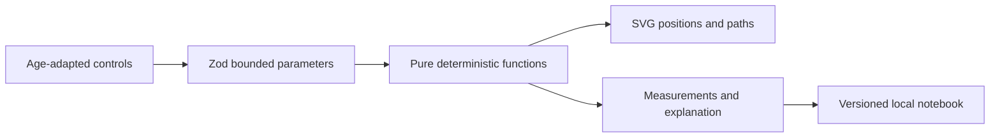

# Architecture

## Application model

Next.js renders the public and explanatory pages. React client components own experiment interaction, animation timing and the local notebook. A single API route handles optional activity planning. No account or remote database is required; an age bracket replaces a birth date.

## Scientific engine

Motion uses metres, seconds, degrees and m/s²: x = v cos(theta)t; y = v sin(theta)t - g t²/2. Flight ends at the starting ground level. The comparison changes gravity only, uses the same initial velocity and angle, and draws both paths with a shared spatial scale. Constant gravity, a flat surface and no air resistance are explicit assumptions. Maximum height and range are derived from the same model as the animation.

Pendulum period is T = 2π sqrt(L/g). The position uses the small-angle harmonic approximation, no damping, and an amplitude range of 1–10°. The diagram's length is illustrative; displayed period and clock use the calculated value. The approximation is not presented as exact at large angles.

Light uses additive RGB display channels from 0–255. Mixing lights differs from mixing paints. RGB code values are not photometric measurements, and this model does not simulate real spectra or colour management.

Sources: [OpenStax projectile motion](https://openstax.org/books/university-physics-volume-1/pages/4-3-projectile-motion), [OpenStax pendulums](https://openstax.org/books/university-physics-volume-1/pages/15-4-pendulums), [The Physics Classroom: colour addition](https://www.physicsclassroom.com/class/light/Lesson-2/Color-Addition).

## Different ages

Ages 4–6 choose large illustrated presets with a grown-up. Ages 7–10 use sliders and concrete observations. Ages 10–14 see additional parameters and quantitative explanations. Prediction is encouraged, not scored. Animation can pause, skips directly to the calculated result for reduced-motion users, and stops advancing in a background tab. Optional speech chooses a local English browser voice; text always remains available.

## Notebook

The versioned Zod schema bounds content and checks each lab's parameters. Up to 50 discoveries are stored on the current device. A stored discovery reconstructs its diagram from validated parameters and links back to the same settings. It includes prediction, observation and calculated result. JSON export is provided; browser storage is not durable cloud backup. A user can remove individual discoveries. No child identity or public profile is created.

## Bounded AI

A parent confirms the planning role. Inputs are short, validated and rate limited per process. The optional model returns only a module and preset from finite lists. Both schema and lab-specific mapping are checked. The app uses curated instructional language and a deterministic engine; it never executes generated code or trusts a language model for physics. Without credentials, a keyword selector explicitly returns a prewritten activity. A provider failure falls back to that activity when possible, otherwise exposes a helpful error.

The planner does not infer a precise experiment duration, create new simulations or replace science/content review. The per-process limiter is suitable only for a small protected demonstration; add a shared quota and provider spending limit before enabling public paid calls.
